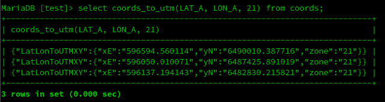
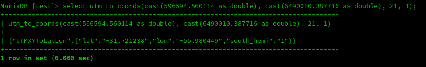
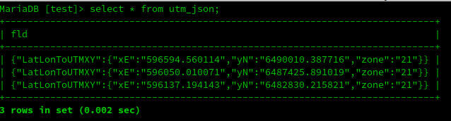
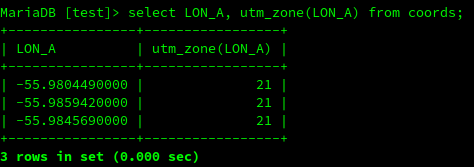

## vcplocation - Native C++ UDF library for MariaDB(tm)

It is a minimal library of functions related to Geo localization
to be used directly in SQL statements in MariaDB(tm).

The library is composed of UDFs written in C++ and were compiled and tested in the Linux environment.
The functions are mathematically correct and can be used in the most varied cases to which they apply.

As for performance, we were unable to test them with thousands or more geographic data. However, given the characteristics inherent to the development model, we believe that the expected high performance will be achieved.

## Aggregations
The sum of the distances between the points, resulting in the total walking distance.

_DOUBLE geo_sumdist(lat_a DOUBLE, lon_a DOUBLE, lat_b DOUBLE, lon_b DOUBLE, VARCHAR()/CHAR())_

The 'unit' argument refers to the unit of measurement in which the distance will be calculated, which can be either _'km'_ or _'mi'_.

Minimal table:

-- lat_a and lat_b [-]000.0000000000
```
create table coords (<br>
  pto varchar(5) not null,<br>
  lat_a double(15,10) not null,<br>
  lat_b double(15,10) not null,<br>
);<br>

insert into coords (pto, lat_a, lon_a) values ('p00',-31.721238,-55.980449);<br>
insert into coords (pto, lat_a, lon_a) values ('p01',-31.744598,-55.985942);<br>
insert into coords (pto, lat_a, lon_a) values ('p02',-31.786047,-55.984569);<br>

MariaDB [test]> select geo_sumdist(lat_a, lon_a,'km') from coords;
+---------------------------+
| geo_sumdist(lat_a, lon_a) |
+---------------------------+
|              7.2596970221 |
+---------------------------+
```
_NOTE_: The sum value can be returned in either Kilometers (km) or Miles (mi).<br>
        If the user does not inform which unit of measurement is used,<br>
        the function returns the value in km.<br>
_NOTE_: It can be different from the distance calculated from the<br>
         coordinates between the start point A and end point B directly.


## Functions
Calculates the distance between two point given their geographical coordinates, latitude and longitude. Use Haversine formula. The coordinate fields must be informed decimal degrees.<br>
_DOUBLE geo_distance(lat_a DOUBLE, lon_a DOUBLE, lat_b DOUBLE, lon_b DOUBLE, unit VARCHAR()/CHAR());_

Calculate the azimuth from latitude and longitude.The coordinate fields must be informed decimal degrees.<br>
_DOUBLE geo_azimuth(lat_a DOUBLE, lon_a DOUBLE, lat_b DOUBLE, lon_b DOUBLE);_

Convenience function to convert between some measurement units.<br>
Arguments:
cnv: kmh_to_mih | mih_to_kmh | mi_to_meters | meters_to_mi | feet_to_meteres | meters_to_feet.
unit_val: Value to be converted<br>
e.g:<br>
Field: veloc<br>
Value: 100.0<br>
select unit_convert(veloc, "kmh_to_mih"); or select unit_convert(veloc, 2, "kmh_to_mih");<br>
Returns:  62.1371 or 62.13<br>

_DOUBLE unit_convert(unit_val DOUBLE, [dec-places INT,] cnv VARCHAR());_<br>

Converts Latitude/Longitude geographic coordinates to UTM.<br>
Functions return values in JSON-format.<br>


_STRING coords_to_utm(double, dobule, integer)_<br>
Arguments: latitude, longitude, UTM zone<br>


_STRING utm_to_coords(double, double, integer, integer)_<br>
Arguments: UTM X, UTM Y, ZONE, SOUTH_HEMISQUIT.<br>
Note: If the coordinates are in the southern hemisphere, enter 1, otherwise 0.<br>


To convert a table from Latitudes and Longitudes to UTM into another table in JSON-format.<br>
```
--Used to save the result of converting GPS coordinates to UTM in JSON format
create table utm_json (
  fld_j json
);

INSERT INTO utm_json (fld_j) SELECT coords_to_utm(LAT_A, LON_A, 21) FROM coords;
```



_INTEGER utm_zone(double)<br>
Arguments: Longitude in decimal.<br>
Returns the calculation of the Zone UTM given the Longitude of the point.<br>



Checks whether a Latitude or Longitude is valid.<br>
Returns 1 for valid and 0 for invalid.<br>
_INTEGER is_valid_lat(double)_<br>
_INTEGER is_valid_lon(double)_<br>


### Create UDF's

To create (register) the UDF's to used in the database, we will use the DDL's that are encoded in the __docs/create-funcs.sql__ file.

__Line command:__ Using mysql command.

mysql [-p] [-D test] <  docs/impala-create-funcs.sql
