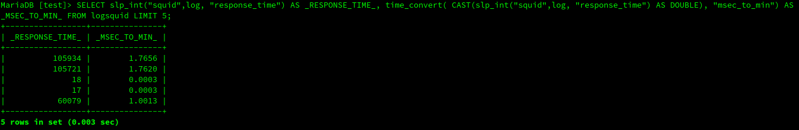

## vcputilities - Native C++ UDF library for MariaDB(tm)

It is a minimal library of functions related
to be used directly in SQL statements in MariaDB(tm).

The library is composed of UDFs written in C++ and were compiled and tested in the Linux environment.

As for performance, we were unable to test them with thousands or more data. However, given the characteristics inherent to the development model, we believe that the expected high performance will be achieved.

This project is still in its early stages of development and I hope to be able to improve it as much as possible.

An objective that we greatly appreciated during development was
that we can contribute so that more people can understand
how UDF's in C++ can be programmed for use in MariaDB(tm)/MySQL(tm) and take advantage the best of this technique.

## General Syntax

First argument: field name. Must be on of these: DOUBLE, DECIMAL or INTEGER<br>
Second argument: condition. Are valid: '=', '<>', '>', '>=', '<', '<='<br>
Third argument: value or field name. this argument is sensitive to decimal places. If you enter 10, it will be considered as an integer, if you enter 10.0 as a decimal/double number.<br>

## Aggregations

These aggregations were developed to simplify some SQL statements, eliminating the use of conditions in the WHERE clause as much as possible, but maintaining the high performance of the system.

### count_if(fieldname,condition,value)

Implementation of the count_if() aggregation, which will count the number of lines based on an established condition.

_INTEGER count_if(fieldname, condition, value|fieldname)_

e.g:

SELECT count_if(salary, '>', 10000.0) FROM tsal;

Approach using the WHERE clause:

SELECT COUNT(salary) FROM tsal WHERE salary > 10000.0

### sum_if(fieldname,condition,value)

Implementation of the sum_if() aggregation, which will calculate the sum of the values of the past field as the first argument.

_REAL sum_if(fieldname, condition, value|fieldname)_

e.g:

SELECT sum_if(salary, '>', 10000.0) FROM tsal;

Approach using the WHERE clause:

SELECT SUM(salary) FROM tsal WHERE salary > 10000.0

### avg_if(fieldname,condition,value)

Implementation of the avg_if() aggregation, which will calculate the average of the values of the past field as the first argument.

_REAL avg_if(fieldname, condition, value|fieldname)_

e.g:

SELECT avg_if(salary, '>', 10000.0) FROM tsal;

Approach using the WHERE clause:

SELECT AVG(salary) FROM tsal WHERE salary > 10000.0

## Functions
Conversion between time units.

#### _DOUBLE time_convert(double, string)_
The unit to be converted must be in base 10.<br>
The table field must have been created with the DOUBLE type and in case of using a constant it is necessary to use CAST(n as DOUBLE).<br>

Arg #1: Unit to be converted.
Arg #2: Type of conversion operation.

Valid operations:

"hour_to_min" | "hour_to_sec" | "hour_to_msec" |<br>
"min_to_hour" | "min_to_sec" | "min_to_msec" |<br>
"sec_to_hour" | "sec_to_min" | "sec_to_msec" |<br>
"msec_to_hour" | "msec_to_min" | "msec_to_sec" |<br>
"to_base10" | "to_base60"<br>

The types of conversion between hours, for example hour_to_min, don't check<br>
whether or not the value belongs to a valid time, that is, if we type<br>
time_convert(125,"hour_to_min") the result will be 2.0833 and so on.<br>

In the case of base conversions, proceed as follows:<br>
The general format of the value used is: hh.mmss.<br>

time_convert(2.5959, "to_base10") -> 2.993167

time_convert(2.993167, "to_base60") -> 2.5959<br>
__In this case the precision is very important, if we use less decimal places<br>
the value will be calculated wrong.__

```
SELECT time_convert( CAST( 5 AS DOUBLE), "hour_to_min") );

SELECT time_convert(cast( 10.1536 as double),"to_base10");
Result: 10.2560

SELECT time_convert(cast( 10.2560 as double),"to_base60");
Result: 10.1536

SELECT time_convert(times_d,"to_base60") from times_tbl;
```


## Instructions

### Create UDF's

To create (register) the UDF's to used in the database, we will use the DDL's that are encoded in the __docs/create-funcs.sql__ file.

__Line command:__ Using mysql command.

mysql [-p] -D mysql <  docs/create-funcs.sql
